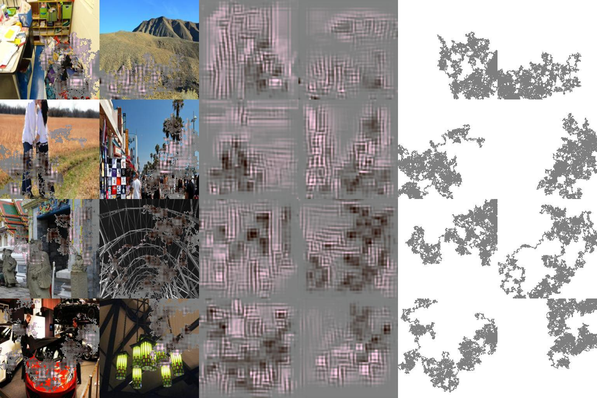
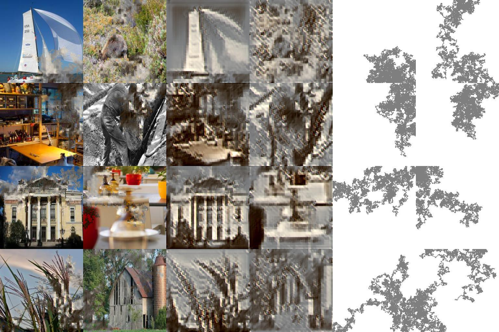
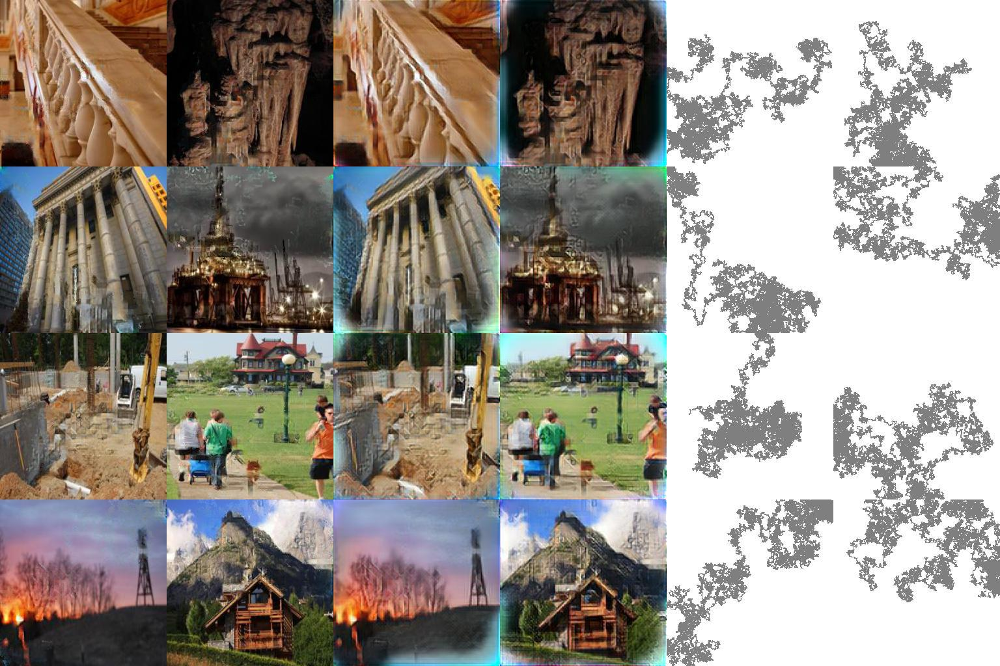

# chainer-partial_convolution_image_inpainting
Reproduction of Nvidia image inpainting paper "Image Inpainting for Irregular Holes Using Partial Convolutions" https://arxiv.org/abs/1804.07723

1,000 iteration results  (completion, output, mask) "completion" represents the input images whose masked pixels are replaced with the corresonded pixels of the output images 


10,000 iteration results  (completion, output, mask)  


100,000 iteration results  (completion, output, mask)  


# Environment
- python3.5.3  
- chainer4.0alpha    
- opencv (only for cv.imread, you can replace it with PIL)  
- PIL  

# How to try

## Download dataset (place2)
[Place2](http://places2.csail.mit.edu/)  

## Set dataset path

Edit common/paths.py
```python
train_place2 = "/yourpath/place2/data_256/"
val_place2 = "/yourpath/place2/val_256/"
test_place2 = "/yourpath/test_256/"

```
## Preprocessing  
In this implementation, masks are automatically generated in advance.  
```python
python generate_windows.py image_size generate_num
```
"image_size" indicates image size of masks.  
"generate_num" indicates the number of masks to generate.  

Default implementation uses image_size=256 and generate_num=1000.  
Note that original paper uses 512x512 image and generate mask with different way. 

## Run training
```python
python train.py -g 0 
```
-g represents gpu option.(utilize gpu of No.0) 

## Difference from original paper
Firstly, check [implementation FAQ](http://masc.cs.gmu.edu/wiki/partialconv)
1. C(0)=0 in first implementation (already fix in latest version)
2. Masks are generated using random walk by generate_window.py
3. To use chainer VGG pre-traied model, I re-scaled input of the model. See updater.vgg_extract. It includes cropping, so styleloss in outside of crop box is ignored.)
4. Padding is to make scale of height and width input:output=2:1 in encoder stage.  

other differences:  
- image_size=256x256 (original: 512x512)


## Acknowledgement
This repository utilizes the codes of following impressive repositories   
- [chainer-cyclegan](https://github.com/Aixile/chainer-cyclegan)  
