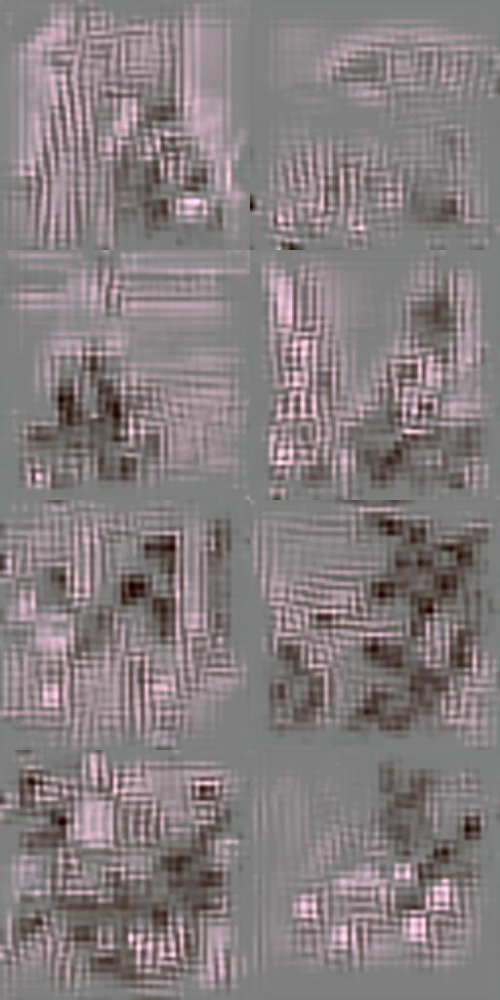
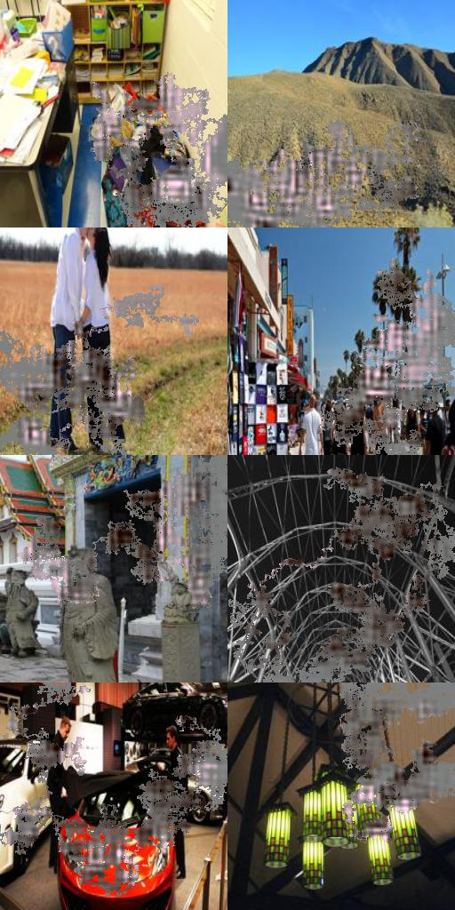
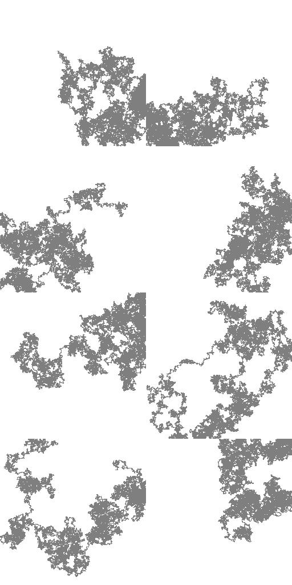
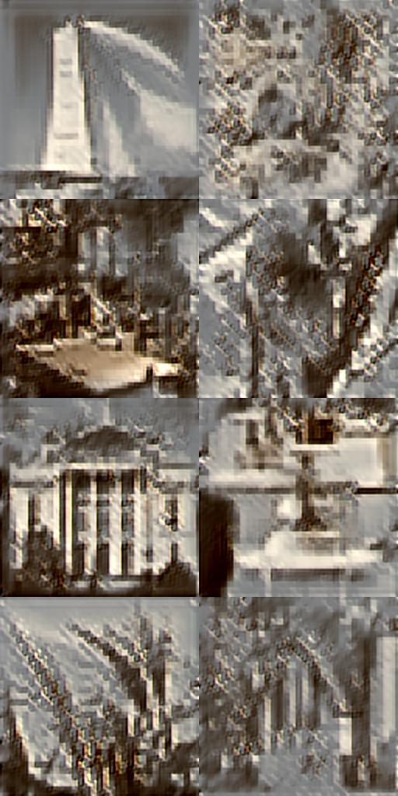
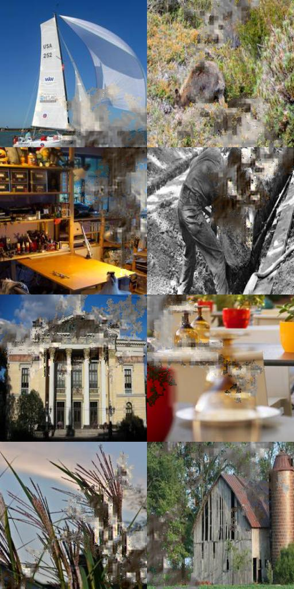
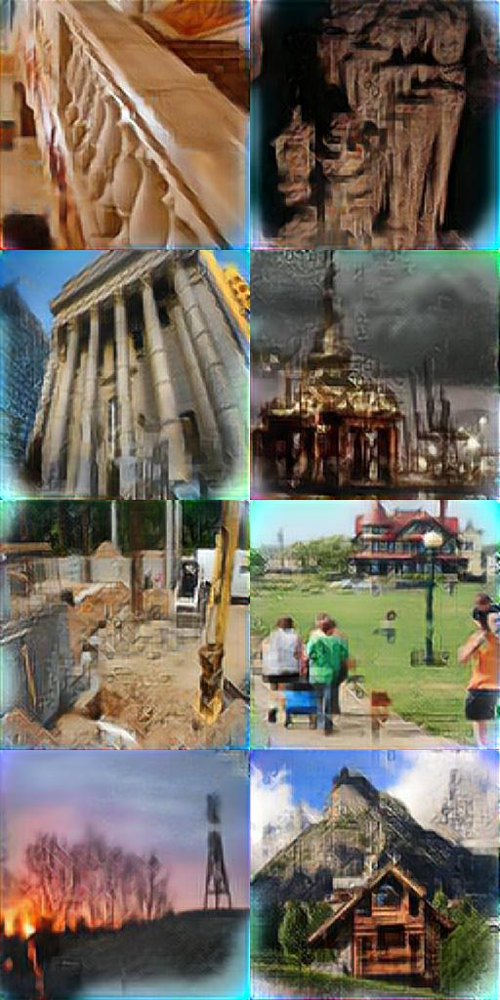
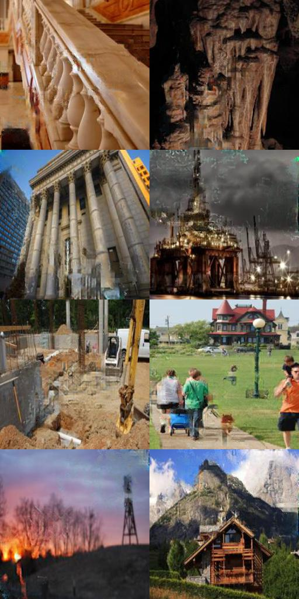

# chainer-partial_convolution_image_inpainting
Reproduction of Nvidia image inpainting paper "Image Inpainting for Irregular Holes Using Partial Convolutions" https://arxiv.org/abs/1804.07723











# Environment
python3.5.3
chainer4.0alpha  
opencv (only for cv.imread, you can replace it with PIL)  
PIL

# How to try

## Download dataset (place2)
[Place2http](//places2.csail.mit.edu/)  

## Set dataset path

Edit common/paths.py
```python
train_place2 = "/yourpath/place2/data_256/"
val_place2 = "/yourpath/place2/val_256/"
test_place2 = "/yourpath/test_256/"

```
## Preprocessing  
In this implementation, masks are automatically generated in advance.  
```python
python generate_windows.py image_size generate_num
```
"image_size" indicates image size of masks.  
"generate_num" indicates the number of masks to generate.  

Default implementation uses image_size=256 and generate_num=1000.  
Note that original paper uses 512x512 image and generate mask with different way. 

## Run training
```python
python train.py -g 0 
```
-g represents gpu option.(utilize gpu of No.0) 

